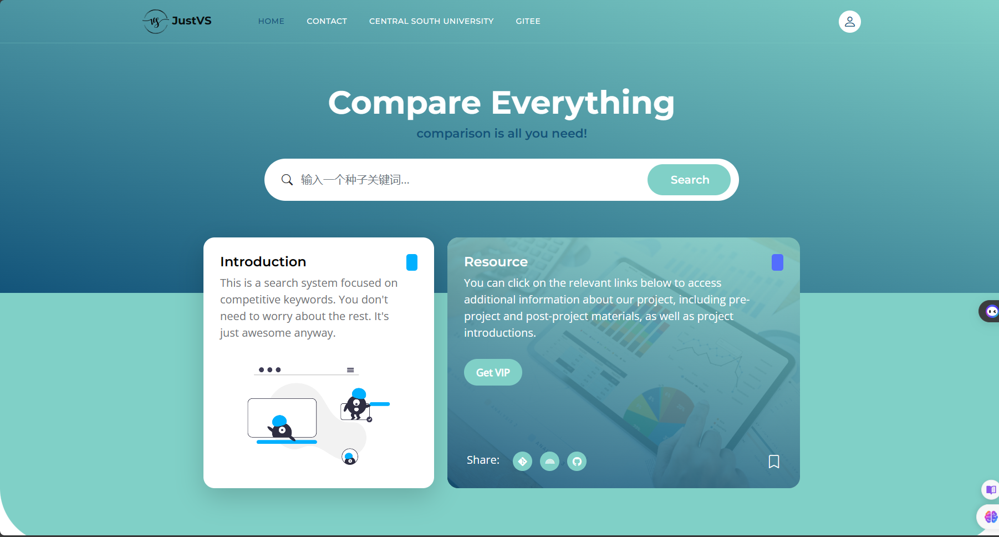
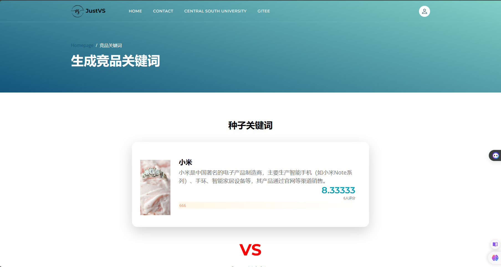
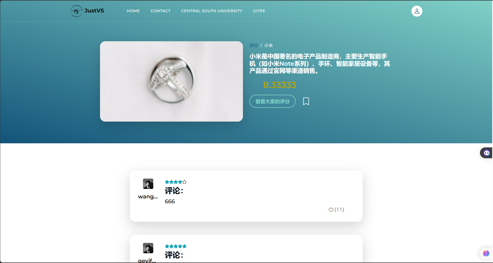
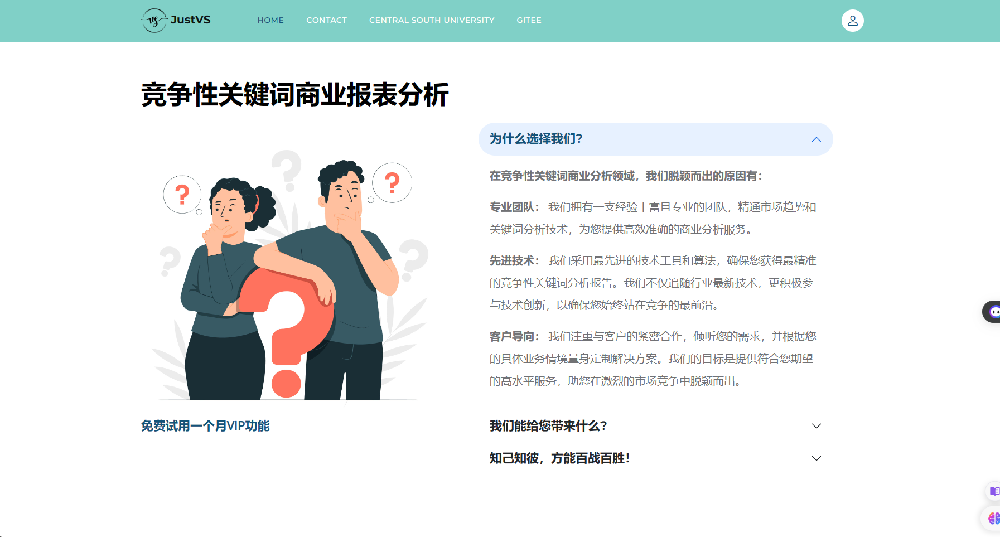
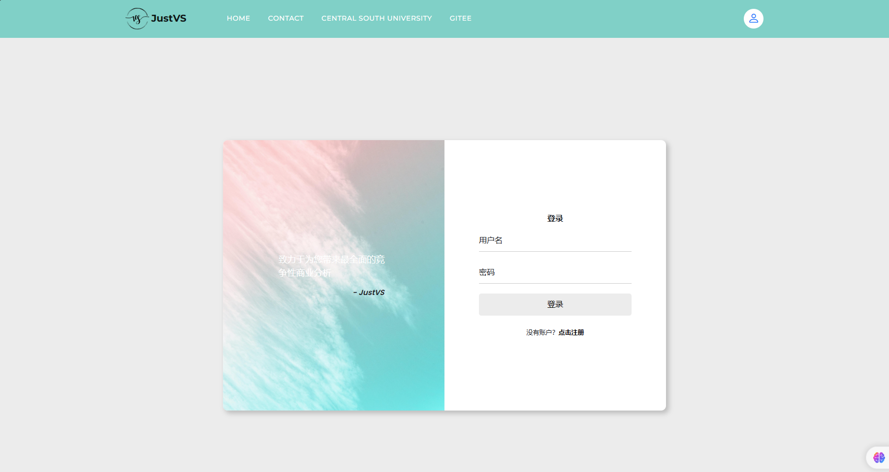
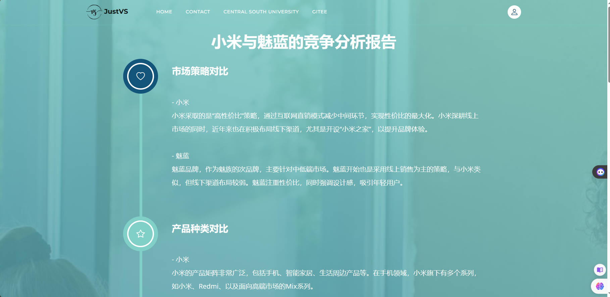

# Py-CompKey-Sys

#### 介绍
    本系统的名称为JustVS，意为“就比一下吧”
    系统的标语为comparison is all you need！ 源于attention is all you need！注意力机制的paper
    这个系统主要是基于compkey算法实现的搜索系统，项目性质属于CSU的课程大作业
    参考的话，先给个三连哦！（虽然不太可能被参考😪）

#### 环境
    python3.9
    pycharm2022
    mysql8

#### 快速开始
##### 配置虚拟环境
    #   安装虚拟环境依赖
    1.  pip install virtualenv
    #   创建虚拟环境
    2.  virtualenv venv
    #   激活虚拟环境
    3.  venv/Scripts/activate

##### 安装依赖
    # 安装完虚拟环境后，运行下列代码导入依赖
    1.  pip install -r requirement.txt

##### 数据库初始化
    # 这是migrate的数据库初始化和迁移的操作，如果对数据库model有修改建议执行
    1.  flask db init
    2.  flask db migrate
    # 下面是数据库的创建
    3. 创建compkey的数据库，运行sql文件，导入数据，这个数据库是已经跑过有数据的，如果重新跑可能比较耗时

##### 项目配置文件
    在settings下的config.py进行数据库和ChatGPT的配置，
    建议新建一个private_config.py文件作为私人的配置文件，将config.py的内容粘过来
    然后在settings的__init__.py中修改from .config import Config为from .private_config import Config
    如果没有ChatGPT的key的话，项目的生成竞品分析报告功能是不能使用的，
    而且搜索数据库没有的新词的时候，不能生成关键词的图片和描述

##### 运行
    flask run

#### 其他要求
    项目用到的数据为谷歌2016年的搜索记录（应该是），以老师提供的数据为准
    本项目使用了ChatGPT的接口和访问了Unsplash的网站、谷歌地图网站，所以需要进行科学上网，不能会出现图片加载不出来的情况
    点击种子关键词和竞争关键词的图片进入评论页面

#### 运行的界面截图

#### 项目结构
    algorithm：算法相关文件夹
    application：蓝图和业务的文件夹
    extensions：主要存放初始化的文件
    models：模型类，使用SQLAchemy的模型类
    settings：配置文件
    static：静态文件
    templates：模板
    utils：工具类

#### 相关链接

1.  项目的算法开发仓库为[https://gitee.com/jiayouquba/py-comp-key-dev](https://gitee.com/jiayouquba/py-comp-key-dev)
2.  遇到什么问题可以通过下列邮箱联系我(1113438067@qq.com)
